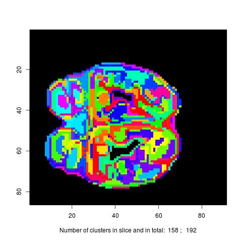

Loading library and example data.
```{r loadlib}
library(DLA)
data(LabelArrayExample)
```
Data *LabelArrayExample* is a 3 dimension array.
```{r}
dim(LabelArrayExample)
```

Follwoing command displays *LabelArrayExample* slice by slice, in which different labels have different colors. The folder *Images* will be created in the working directory, containing images *Image.n.jpg* where *n* is slice index.

```{r, eval=FALSE}
DisplayLabArr(label.array=LabelArrayExample, bg.index = bg.index, 
foldername="Images", filename_pre="Image")
```
An example of resulting images.




